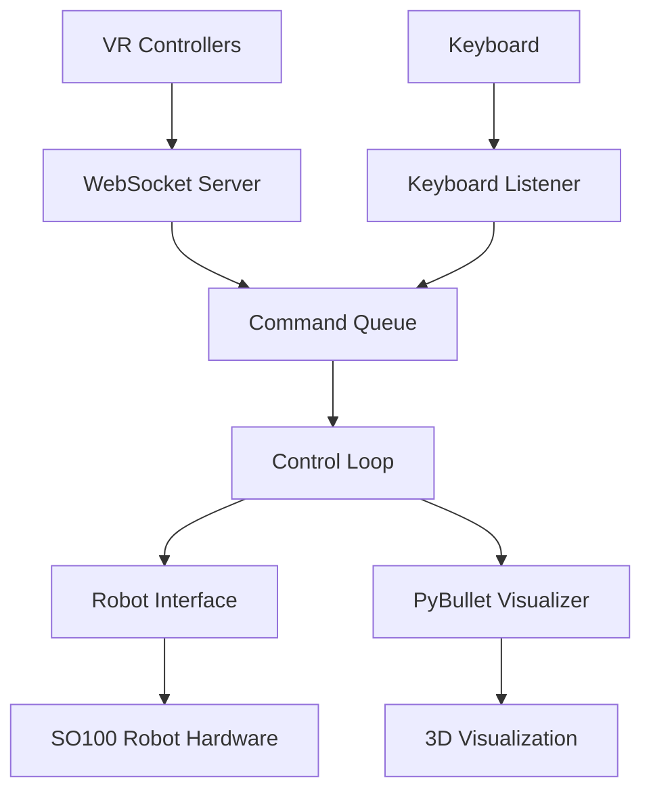

# VR 摇操双臂MKrobot
clone代码， 安装：pip install -e .
连接机械臂，终端启动telegrip
VR 进入，浏览器链接到对应地址。
长按X/A启动对应机械臂
抓住grip按键可以控制机械臂移动
短按X/A机械臂归零


# telegrip - SO100 Robot Arm Teleoperation System

An open source teleoperation control system for the [SO100 robot arm](https://github.com/TheRobotStudio/SO-ARM100) that supports input from VR controllers or keyboards with shared inverse kinematics, 3D visualization and a web UI.


*Using a VR headset like the Meta Quest and the built-in WebXR app, controller movements are streamed to the telegrip controller so you can record training data without a dedicated leader arm.*

https://github.com/user-attachments/assets/e21168b5-e9b4-4c83-ab4d-a15cb470d11b


*telegrip operation of two SO-100 arms using a Quest 3 headset*


## Features

- **Unified Architecture**: Single entry point that coordinates all components
- **Multiple Input Methods**: VR controllers (Quest/WebXR) and keyboard control
- **Shared IK/FK Logic**: PyBullet-based inverse and forward kinematics for both arms
- **Real-time Visualization**: 3D PyBullet visualization with coordinate frames and markers
- **Safety Features**: Joint limit clamping, graceful shutdown, and error handling
- **Async/Non-blocking**: All components run concurrently without blocking

## Installation

### Prerequisites

1. **Robot Hardware**: One or two SO100 arm robot with USB-serial connections
2. **Python Environment**: Python 3.8+ with required packages
3. **VR Setup** (optional): Meta Quest or other headset with WebXR support (no app installation needed!)


### Package Installation

You must first manually install LeRobot according to the official instructions at [https://github.com/huggingface/lerobot](https://github.com/huggingface/lerobot).

Follow the official LeRobot installation guide:

```bash
# Clone the official LeRobot repository
git clone https://github.com/huggingface/lerobot.git
cd lerobot
# Install according to their instructions (typically):
pip install -e .
```

After installing LeRobot, install telegrip (this package):

```bash
# Install in editable mode (recommended for development)
git clone https://github.com/DipFlip/telegrip.git
pip install -e .
```

The system will automatically create self-signed SSL certificates (`cert.pem` and `key.pem`) if they don't exist.

If you need to generate them manually for any reason:

```bash
openssl req -x509 -newkey rsa:2048 -keyout key.pem -out cert.pem -sha256 -days 365 -nodes -subj "/C=US/ST=Test/L=Test/O=Test/OU=Test/CN=localhost"
```

## Usage

### Basic Usage

Run the complete teleoperation system:

```bash
telegrip
```
The first time you might be asked to complete pose calibrations as shown in [this guide](https://github.com/huggingface/lerobot/blob/8cfab3882480bdde38e42d93a9752de5ed42cae2/examples/10_use_so100.md#e-calibrate). Calibration files are stored in `.cache/calibration/so100/arm_name.json`. When calibration files are found, you will be greeted with a message like 
```bash
🤖 telegrip starting...
Open the UI in your browser on:
https://192.168.7.233:8443
Then go to the same address on your VR headset browser
```
Click on or enter your address in a browser to show the UI. Visit the same address from your VR headset to enter the VR web-app. The first time you should enter robot arm port information under the settings menu (top right). Alternatively you can manually enter the details in the `config.yaml` file in the root of this repo.
Once you see that the robot arms are found (green indicators) you can click "Connect Robot" and start controlling it by keyboard or with the VR headset.

### Command Line Options

```bash
telegrip [OPTIONS]

Options:
  --no-robot        Disable robot connection (visualization only)
  --no-sim          Disable PyBullet simulation and inverse kinematics
  --no-viz          Disable PyBullet visualization (headless mode)
  --no-vr           Disable VR WebSocket server
  --no-keyboard     Disable keyboard input
  --autoconnect     Automatically connect to robot motors on startup
  --log-level LEVEL Set logging level: debug, info, warning, error, critical (default: warning)
  --https-port PORT HTTPS server port (default: 8443)
  --ws-port PORT    WebSocket server port (default: 8442)
  --host HOST       Host IP address (default: 0.0.0.0)
  --urdf PATH       Path to robot URDF file
  --left-port PORT  Left arm serial port (default: /dev/ttySO100red)
  --right-port PORT Right arm serial port (default: /dev/ttySO100leader)
```

### Development/Testing Modes

**Visualization Only** (no robot hardware):
```bash
telegrip --no-robot
```

**Keyboard Only** (no VR):
```bash
telegrip --no-vr
```

**No Simulation** (no PyBullet sim or IK):
```bash
telegrip --no-sim
```

**Headless** (no PyBullet GUI):
```bash
telegrip --no-viz
```

**Auto-connect to Robot** (skip manual connection step):
```bash
telegrip --autoconnect
```

## Control Methods

### VR Controller Control

1. **Setup**: Connect Meta Quest to same network, navigate to `https://<your-ip>:8443`

2. **Arm Position Control**: 
   - **Hold grip button** to activate position control for that arm
   - While holding grip, the robot arm gripper tip will track your controller position in 3D space
   - Release grip button to deactivate position control

3. **Wrist Orientation Control**:
   - The **roll and pitch** of your controller will be matched on the wrist joint of the arm
   - This allows precise orientation control of the end effector

4. **Gripper Control**:
   - Press and **hold trigger button** to close the gripper
   - The gripper stays closed as long as you hold the trigger
   - Release trigger to open the gripper

5. **Independent Control**: Left and right controllers control their respective robot arms independently - you can operate both arms simultaneously or one at a time

### Keyboard Control

**Left Arm Control**:
   - **W/S**: Forward/Backward
   - **A/D**: Left/Right 
   - **Q/E**: Down/Up
   - **Z/X**: Wrist roll
   - **F**: Toggle gripper open/closed

**Right Arm Control**:
   - **I/K**: Forward/Backward
   - **J/L**: Left/Right
   - **U/O**: Up/Down
   - **N/M**: Wrist roll
   - **; (semicolon)**: Toggle gripper open/closed

## Architecture

### Component Communication



### Control Flow

1. **Input Providers** (VR/Keyboard) generate `ControlGoal` messages
2. **Command Queue** buffers goals for processing
3. **Control Loop** consumes goals and executes them:
   - Converts position goals to IK solutions
   - Updates robot arm angles with safety clamping
   - Sends commands to robot hardware
   - Updates 3D visualization
4. **Robot Interface** manages hardware communication and safety

### Data Structures

**ControlGoal**: High-level control command
```python
@dataclass
class ControlGoal:
    arm: Literal["left", "right"]           # Target arm
    mode: ControlMode                       # POSITION_CONTROL or IDLE
    target_position: Optional[np.ndarray]   # 3D position (robot coordinates)
    wrist_roll_deg: Optional[float]         # Wrist roll angle
    gripper_closed: Optional[bool]          # Gripper state
    metadata: Optional[Dict]                # Additional data
```

## Configuration

### Robot Configuration

- **Joint Names**: `["shoulder_pan", "shoulder_lift", "elbow_flex", "wrist_flex", "wrist_roll", "gripper"]`
- **IK Joints**: First 3 joints used for position control
- **Direct Control**: Wrist roll and gripper controlled directly
- **Safety**: Joint limits read from URDF and enforced

### Network Configuration

- **HTTPS Port**: 8443 (web interface)
- **WebSocket Port**: 8442 (VR controllers)  
- **Host**: 0.0.0.0 (all interfaces)

### Coordinate Systems

- **VR**: X=right, Y=up, Z=back (toward user)
- **Robot**: X=forward, Y=left, Z=up
- **Transformation**: Handled automatically in kinematics module

## Troubleshooting

### Common Issues

**Robot Connection Failed**:
- Check USB-serial device permissions: `sudo chmod 666 /dev/ttySO100*`
- Verify port names match actual devices
- Try running with `--no-robot` for testing

**VR Controllers Not Connecting**:
- Ensure Quest and robot are on same network
- SSL certificates are generated automatically, but check `cert.pem` and `key.pem` exist if issues persist
- Try accessing web interface directly in browser first
- If OpenSSL is missing, install it: `sudo apt-get install openssl` (Ubuntu) or `brew install openssl` (macOS)

**PyBullet Visualization Issues**:
- Install PyBullet: `pip install pybullet`
- Try headless mode: `--no-viz`
- Check URDF file exists at specified path

**Keyboard Input Not Working**:
- Run with appropriate permissions for input access
- Check terminal has focus for key events
- Try `--no-keyboard` to isolate issue

### Debug Modes

**Detailed Logging**:
```bash
telegrip --log-level info    # Show detailed startup and operation info
telegrip --log-level debug   # Show maximum detail for debugging
```

**Component Isolation**:
- Test individual components with disable flags
- Check component status in logs
- Verify queue communication

## Development

### Adding New Input Methods

1. Create new input provider inheriting from `BaseInputProvider`
2. Implement `start()`, `stop()`, and command generation
3. Add to `TelegripSystem` initialization
4. Configure via command line arguments

### Extending Robot Interface

1. Add new methods to `RobotInterface`
2. Update `ControlGoal` data structure if needed
3. Modify control loop execution logic
4. Test with `--no-robot` mode first

### Custom Visualization

1. Extend `PyBulletVisualizer` class
2. Add new marker types or coordinate frames
3. Update visualization calls in control loop

## Safety Notes

- **Emergency Stop**: Press Ctrl+C for graceful shutdown
- **Joint Limits**: Automatically enforced from URDF
- **Initial Position**: Robot returns to safe position on shutdown
- **Torque Disable**: Motors disabled during shutdown sequence
- **Error Handling**: System continues running if non-critical components fail

## License

This project is licensed under the MIT License - see the [LICENSE](LICENSE) file for details.
